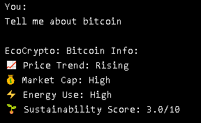

# EcoCrypto - Sustainable Cryptocurrency Advisor

## Project Overview
EcoCrypto is an AI-powered chatbot designed to provide cryptocurrency recommendations with a focus on sustainability. The bot analyzes real-time cryptocurrency data from CoinGecko's API and provides tailored advice based on user queries about profitability, sustainability, or specific cryptocurrencies.

## Created By
**Username:** AlphaC137  
**Course:** AI for Software Engineering

## Features
- **Real-time Cryptocurrency Data**: Fetches current prices and trends from CoinGecko API
- **Sustainability Analysis**: Rates cryptocurrencies based on environmental impact
- **Profit-focused Analysis**: Evaluates investment potential using latest market data
- **Detailed Information**: Provides comprehensive stats on specific cryptocurrencies
- **Balanced Recommendations**: Combines profitability metrics with sustainability factors
- **Interactive Interface**: User-friendly conversational experience with emoji indicators

## Data Integration
The chatbot combines two data sources:
1. **Dynamic Data (CoinGecko API)**: 
   - Current prices
   - 24-hour price changes
   - Market capitalization
   - Price trends

2. **Static Sustainability Data**:
   - Energy consumption ratings
   - Sustainability scores (0-10 scale)

## How It Works
The chatbot uses a combination of API data and conditional logic to:

1. **Real-time Analysis**: Fetches current cryptocurrency market data
2. **Query Processing**: Identifies user intent through keyword recognition
3. **Decision Making**: Applies weighted scoring algorithms to balance profit potential with environmental impact
4. **Response Generation**: Delivers personalized cryptocurrency recommendations with relevant metrics

## Sample Interactions

```
EcoCrypto: Hey there! I'm EcoCrypto, your eco-friendly crypto guide! 🌱

You: What are the current prices?
EcoCrypto: Current cryptocurrency prices (USD):

Bitcoin: $41,253.67 🔴 -2.14%
Ethereum: $2,865.32 🟢 1.23%
Cardano: $1.45 🟢 3.75%
Solana: $192.67 🟢 5.21%
Polkadot: $23.84 ⚪ 0.05%
Algorand: $1.23 🔴 -0.89%

You: Which cryptocurrency is the most sustainable?
EcoCrypto: For sustainability-focused investors, I recommend Algorand. It scores 9/10 on our green scale! ğŸŒ

You: Which crypto is trending up?
EcoCrypto: For profit potential, check out Solana! It's trending upward with a 24h change of 5.21% with a medium market cap. 📈

You: Tell me about Cardano
EcoCrypto: Cardano Info:
💵 Current Price: $1.45
📊 24h Change: 🟢 3.75%
📈 Price Trend: Rising
💰 Market Cap: Medium
âš¡ Energy Use: Low
🌱 Sustainability Score: 8/10
```

## Screenshots
- Info


- Help


- Tell me about Bitcoin


## Running the Application
1. Ensure you have Python installed
2. Install required packages: `pip install requests`
3. Run the script: `python crypto_advisor_with_api.py`
4. Interact with the chatbot through the command line interface

## Disclaimer
Cryptocurrency investments are risky. This chatbot provides educational information only. Always conduct your own research before investing!
